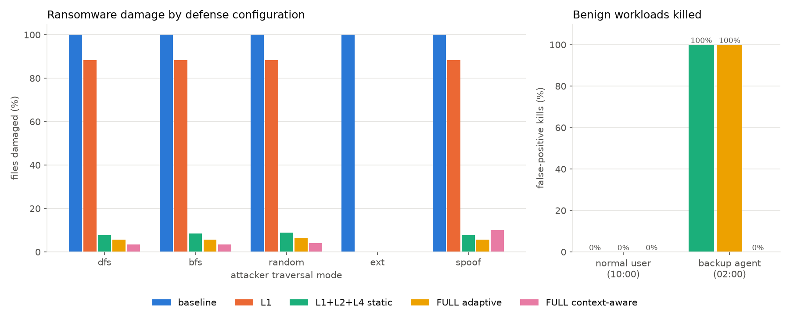

# A Context-Aware, Multi-Layered Moving Target Defense Architecture for Ransomware Mitigation

A Computer Security course project. A user-space research simulation
(`VirtualFS`) applies four Moving Target Defense layers plus a context layer to
every file operation, and a reproducible benchmark measures how much damage a
safe ransomware simulator can do against each defense configuration.

It is not production ransomware protection and it does not use real malware:
the attacker only touches a temporary test workspace through `VirtualFS`.

## Security problem and MTD idea

Ransomware benefits from knowing where valuable files are and from being able to
modify many files quickly. Moving Target Defense reduces that advantage by
changing the attack surface while observing behavior. This project implements:

- **L1:** randomized file names/extensions and harmless header (magic-byte)
  mutation, so the attacker's map of the file system goes stale.
- **L2:** multi-depth decoys/honeyfiles, re-placed at random depths on every
  mutation.
- **L3:** an explainable rolling-window suspicion score (high-entropy writes,
  stale accesses) that shortens the mutation interval as activity becomes more
  aggressive.
- **L4:** a kill-switch that suspends the offending process on a decoy touch or
  a high suspicion score.
- **Context awareness (CTX):** every suspicious event is weighted by its
  context instead of being counted the same way everywhere:
  - **Who** acted: an allow-listed tool (the backup agent) weighs 0.2x and may
    *read* a decoy without being killed; writing or renaming a decoy is always
    fatal, and its stale accesses caused by MTD renames are not scored.
  - **What** was touched: sensitive documents (budget, invoice, client,
    policy) weigh 1.5x.
  - **When** it happened: off-hours activity (outside 08:00-18:59) weighs 1.5x
    and makes MTD rotate 1.5x faster; activity while the user is idle weighs
    1.25x.

## Installation

Python 3.9 or newer, standard library only. `matplotlib` is optional and only
needed to draw `results.png`:

```bash
python -m pip install -r requirements.txt
```

Works on Windows, macOS, and Linux (use `py` or `python3` if `python` is not on
your PATH).

## Run the demo

```bash
python run.py demo
```

Runs one BFS attack against each configuration and prints the event log, then
runs a trusted night-time backup scan against the defended configurations to
show the false positive that context awareness removes.

The safe research attacker supports `dfs`, `bfs`, `random`, and `ext` traversal
modes. The `ext` mode is intentionally documented: it assumes the attacker
knows the original document extensions. After L1 randomizes names/extensions,
that attacker skips files, so its low damage is an expected stale-knowledge
result rather than a hidden benchmark artifact.

## Run the benchmark

```bash
python run.py bench
```

The benchmark compares five configurations (baseline, L1, static L1+L2+L4,
FULL adaptive, FULL context-aware) against five attacks (`dfs`, `bfs`,
`random`, `ext`, and `spoof`, which is DFS ransomware running under the trusted
backup agent's identity). Attack trials are spread over the whole day so the
time-of-day context is exercised. Two benign workloads measure false positives:
a normal user at 10:00 and a trusted backup agent scanning the disk at 02:00.
The benchmark uses operation ticks rather than wall-clock time so trials are
reproducible. Outputs: `results.csv`, `results_fp.csv`, and `results.png`.

Results (20 trials per cell):

| Configuration | Damaged (dfs/bfs/random) | Detected at op | Spoof damage | Backup agent killed |
|---|---|---|---|---|
| baseline | 100% | - | 100% | n/a |
| L1+L2+L4 static | 7.6-8.9% | 16-19 | 7.6% | 100% |
| FULL adaptive | 5.6-6.5% | 12-13 | 5.7% | 100% |
| **FULL context-aware** | **3.4-4.0%** | **8-10** | 10.2% | **0%** |

All defended configurations stop 100% of attacks and kill 0% of normal-user
workloads. Context awareness removes the backup false positive and lowers
damage; the cost is the `spoof` case, where malware that hijacks a trusted
identity is only caught when it writes a decoy (still stopped 100%, but with
10.2% damage).



## Tests

The tests use Python's standard `unittest` module and cover the context layer:
who/what/when weights, the off-hours mutation speed-up, the trusted backup scan
being killed without context and allowed with it, and unknown and spoofed
attackers still being stopped:

```bash
python -m unittest discover -s tests -v
```

## Project structure

```text
mtd_project/
├── mtd.py                    # VirtualFS: L1-L4 defense layers + context layer
├── attacker.py               # safe research ransomware simulator
├── run.py                    # demo and benchmark (+ benign user/backup workloads)
├── results.csv               # benchmark output: attacks
├── results_fp.csv            # benchmark output: false positives
├── results.png               # benchmark chart
├── tests/                    # context-simulation tests
├── requirements.txt
└── README.md
```

## Limitations and future work

The project is a user-space model: real processes could bypass it because they
do not have to use `VirtualFS`. Process trust is a fixed allow-list of process
ids rather than code-signing verification, the score is heuristic, the sample
data is synthetic, and there is no file recovery after an attack is stopped.
There is no network defense, authentication, kernel driver, machine learning,
or enterprise policy engine.

Possible future work includes a kernel- or OS-level file monitor with process
attribution, signed-binary trust instead of a process-id allow-list, rotating
backup vaults with automatic restore, richer benign-workload calibration, and a
controlled lab comparison with additional safe attack patterns.
